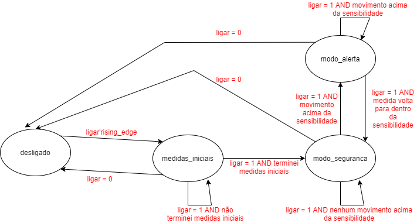

# sistema-seguranca

Esse repositório contém o projeto ***Sistema de Segurança*** desenvolvido na disciplina Laboratório Digital II. O projeto vai ser desenvolvido em três 3 sprints, detalhados abaixo.

## Semana 1: Jornada Básica

O objetivo da Semana 1 do projeto é a implementação das funcionalidades básicas do projeto, suprindo os requisitos funcionais da Jornada Básica do usuário.

### Requisitos Funcionais

O sistema proposto ***no modo de segurança*** deve identificar se houve alguma movimentação no interior de um cômodo e entrar ***no modo de alerta*** caso ocorra a detecção. No modo de alerta é enviada uma mensagem de alerta utilizando a ***UART*** no formato:

> ALERTA horario angulo,distancia

Onde ***horario***, ***angulo*** e ***distancia*** representam o horário da detecção, a posição do servomotor onde foi detectado o movimento e a distância medida pelo sensor ultrassônico nessa posição, respectivamente.

No modo de alerta é ativado um ***buzzer***. O alerta também pode ser visto no celular do cliente pelo aplicativo ***MQTT Dash***

### Requisitos Não-Funcionais

Para detectar o movimento, o sistema deve considerar também a ***imprecisão da medição*** e a ***condição do ambiente*** para gerar a sensibilidade do sensor. 

Caso o ambiente seja fechado e estático, uma variação pequena de medição deve ativar o modo de alerta, mas caso seja um cômodo largo por exemplo, a sensibilidade deve ser ajustada para que o sistema não entre em modo alerta com pequenas variações.

Dessa forma, o projeto possui um sinal de entrada ***nivel_sensibilidade*** que determina a variação de posição mínima para ativação do modo de alerta.

|  Ambiente   |   nivel_sensibilidade   | variação mínima |
| ----------- | ----------------------- | --------------- |
| Banheiro    |           00            |      10cm       |
| Quarto      |           01            |      30cm       |
| Sala        |           10            |      50cm       |
| Salão       |           11            |      100cm      |

### Requisitos Físicos

A princípio, são necessários os componentes do ***Kit Home Lab*** que irão interagir com a infraestrutura física do ***Lab EAD*** da disciplina Laboratório Digital II. Como o sonar será reaproveitado para o projeto do grupo, precisa-se do ***servomotor SG90*** e do ***sensor HC-SR04***, além da ***placa Wemos D1 R1*** que possui o componente ***ESP8266***. Para intermediar a comunicação com a FPGA do laboratório, o aplicativo ***MQTT Dash*** será usado.

### Implementação

#### sistema_seguranca:  Unidade de Controle

#### Transmissão do horário de detecção

Para transmissão do horário de detecção será feita uma integração com um script em python que passa o horário atualizado para a UART.